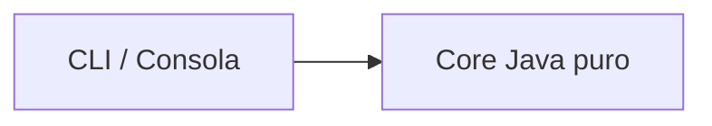
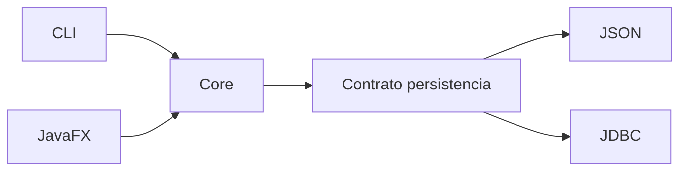

# Proyecto formativo transversal · PetCare

## Propósito

**PetCare** es el proyecto formativo transversal de semestre de DSY1102.

Cada estudiante mantiene una evolución propia del mismo software durante el curso, aplicando lo visto clase a clase y conservando checkpoints verificables.

Material principal del proyecto:

- [Proyecto PetCare](../proyecto-formativo/README.md)
- [Roadmap semanal](../proyecto-formativo/ROADMAP-SEMANAL.md)
- [Arquitectura y continuidad](../proyecto-formativo/ARQUITECTURA-Y-CONTINUIDAD.md)
- [Semana 02](../proyecto-formativo/semana-02/README.md)

## Regla pedagógica

Cada experiencia debe responder:

1. ¿qué checkpoint recibimos?;
2. ¿qué contenido corresponde hoy?;
3. ¿qué problema visible de PetCare permite aplicarlo?;
4. ¿qué cambio hacemos paso a paso?;
5. ¿qué parte resuelve el estudiante?;
6. ¿qué queda funcionando al terminar?;
7. ¿desde dónde continuará la próxima clase?

La experiencia buscada es:

```text
contenido teórico / ejemplo mínimo
        ↓
práctica breve e independiente
        ↓
problema concreto en PetCare o lab
        ↓
implementación guiada
        ↓
parte autónoma breve
        ↓
prueba
        ↓
checkpoint
```

## Evidencia individual

PetCare es individual y acumulativo. El trabajo sostenido puede ser considerado por el docente como evidencia adicional para compensar una calificación baja del semestre cuando corresponda, pero no constituye un reemplazo automático de evaluaciones institucionales.

La evidencia debe mostrar proceso real:

- repositorio propio;
- commits progresivos;
- checkpoints semanales;
- código ejecutable;
- decisiones defendibles;
- explicación técnica cuando sea solicitada.

## Separación respecto de evaluaciones

- PetCare no anticipa el dominio de las evaluaciones sumativas.
- Se pausa cuando corresponda efectivamente durante EP1, EP2 y EP3.
- Después se retoma desde el último checkpoint estable.
- La planificación histórica de evaluaciones no debe sobrescribir el checkpoint real de aula ni el contenido efectivamente liberado.

## Dirección técnica del semestre

La Unidad 1 debe terminar con una separación sencilla y reutilizable:



Luego:



Esto no se enseña completo desde la primera semana. Se construye cuando el contenido lo permite.

## Evolución resumida · checkpoint real al 15 de septiembre de 2026

### Semana 02

Fundamentos Java, condicionales, ciclos, métodos y puente progresivo hacia objetos.

### Semana 03

Clases, objetos, atributos, métodos y encapsulamiento.

### Semana 04

Constructores, estado válido, colaboración/composición introductoria y separación de responsabilidades en entrada por consola.

### Semana 05

Herencia, sobrescritura y polimorfismo dinámico. Veterinaria I funciona como laboratorio integrador de esa progresión.

### Semana 06

Arrays, arrays de objetos, `List` / `ArrayList`, búsqueda/eliminación y excepciones. Veterinaria II integra el conocimiento semanal sobre la solución OO de Semana 05.

### Semanas 07–11

Maven → JavaFX → FXML/eventos → MVC/TableView → persistencia JSON → integración, sujeto al checkpoint real.

### Semana 12

EP2 según calendario institucional vigente.

### Semanas 13–15

JDBC → CRUD → DAO/Repository → integración BD.

### Semana 16

EP3 según calendario institucional vigente.

### Semanas 17–18

EFT/defensa: PetCare puede servir como evidencia histórica y repaso, nunca como pauta de respuesta.

## Regla de continuidad

La interfaz, la persistencia y el core deben evolucionar como responsabilidades diferentes.

La pregunta recurrente será:

> Si mañana cambia la forma de mostrar o guardar los datos, ¿qué código debería seguir funcionando exactamente igual?

Esa pregunta guía las separaciones del proyecto sin convertir el curso en una clase anticipada de arquitectura.
