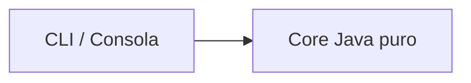
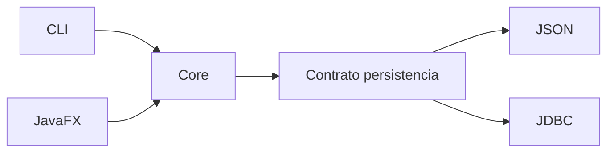

# Proyecto formativo transversal · PetCare

## Propósito

**PetCare** es el proyecto formativo transversal de semestre de DSY1102.

Ya no se entiende solo como un dominio para ejemplos: cada estudiante mantiene una evolución propia del mismo software durante el curso, aplicando lo visto clase a clase y conservando checkpoints verificables.

Material principal del proyecto:

- [Proyecto PetCare](../proyecto-formativo/README.md)
- [Roadmap semanal](../proyecto-formativo/ROADMAP-SEMANAL.md)
- [Arquitectura y continuidad](../proyecto-formativo/ARQUITECTURA-Y-CONTINUIDAD.md)
- [Semana 02](../proyecto-formativo/semana-02/README.md)

## Regla pedagógica

Cada experiencia debe responder:

1. ¿qué checkpoint recibimos?;
2. ¿qué contenido corresponde hoy?;
3. ¿qué problema visible de PetCare permite aplicarlo?;
4. ¿qué cambio hacemos paso a paso?;
5. ¿qué parte resuelve el estudiante?;
6. ¿qué queda funcionando al terminar?;
7. ¿desde dónde continuará la próxima clase?

La experiencia buscada es:

```text
contenido teórico / ejemplo
        ↓
problema concreto en PetCare
        ↓
implementación guiada
        ↓
parte autónoma breve
        ↓
prueba
        ↓
checkpoint
```

## Evidencia individual

PetCare es individual y acumulativo.

El trabajo sostenido puede ser considerado por el docente como evidencia adicional para **compensar una calificación baja del semestre** cuando corresponda, pero no constituye un reemplazo automático de evaluaciones institucionales.

La evidencia debe mostrar proceso real:

- repositorio propio;
- commits progresivos;
- checkpoints semanales;
- código ejecutable;
- decisiones defendibles;
- explicación técnica cuando sea solicitada.

## Separación respecto de evaluaciones

- PetCare no anticipa el dominio de las evaluaciones sumativas.
- Se pausa cuando convenga durante EP1, EP2 y EP3.
- Después se retoma desde el último checkpoint estable.

## Dirección técnica del semestre

La Unidad 1 debe terminar con una separación sencilla y reutilizable:



Luego:



Esto no se enseña completo desde la primera semana. Se construye cuando el contenido lo permite.

La intención es que:

- la CLI sea la interfaz de Unidad 1;
- JavaFX sea otra interfaz en Unidad 2;
- JSON sea un mecanismo de persistencia de Unidad 2;
- JDBC sea otro mecanismo de persistencia en Unidad 3;
- el modelo y las reglas del negocio no tengan que reescribirse cada vez.

## Evolución resumida

### Semana 02

Variables/ciclos → métodos → `Mascota` → encapsulamiento → separación mínima `cli` / `core.model`.

### Semana 03

Herencia, interfaces y polimorfismo cuando el problema del dominio lo justifique.

### Semana 04

Colecciones y excepciones; varias mascotas; búsquedas y operaciones sobre el conjunto.

### Semana 05

Consolidación Unidad 1: core Java puro + CLI.

### Semana 06

EP1: pausa.

### Semanas 07–11

Maven → JavaFX → FXML/eventos → MVC/TableView → persistencia JSON → integración.

### Semana 12

EP2: pausa.

### Semanas 13–15

JDBC → CRUD → DAO/Repository → integración BD.

### Semana 16

EP3: pausa.

### Semanas 17–18

EFT/defensa: PetCare puede servir como evidencia histórica y repaso, nunca como pauta de respuesta.

## Regla de continuidad

La interfaz, la persistencia y el core deben evolucionar como responsabilidades diferentes.

La pregunta recurrente será:

> Si mañana cambia la forma de mostrar o guardar los datos, ¿qué código debería seguir funcionando exactamente igual?

Esa pregunta guía las separaciones del proyecto sin convertir el curso en una clase anticipada de arquitectura.
