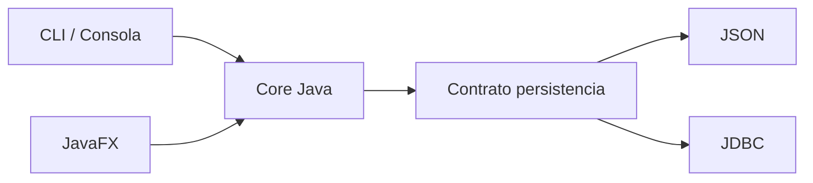

# PetCare · Arquitectura y continuidad docente

Este documento fija la dirección técnica del proyecto para evitar que cada unidad obligue a rehacer el software.

No todo lo descrito aquí se enseña desde el principio. La separación se revela gradualmente a medida que el contenido institucional entrega las herramientas necesarias.

---

# Objetivo técnico

La Unidad 1 debe terminar con un **core Java reutilizable** y una CLI que lo invoque.

Luego JavaFX y JDBC deben agregarse como nuevas formas de interacción/persistencia sin reescribir el negocio.

Dirección general:



---

# Unidad 1 · Java + POO

Meta de salida conceptual:

```text
cl.duoc.petcare
├── core
│   ├── model
│   ├── service
│   └── exception
└── cli
```

No es obligatorio crear todos estos packages desde Semana 02.

La evolución debe ser progresiva.

## Semana 02

Al introducir clases:

```text
core.model
    Mascota

cli
    App
```

`App` puede imprimir y controlar el flujo de consola.

`Mascota` debe representar estado y comportamiento sin conocer la interfaz.

## Semanas 03–05

Cuando aparezcan más responsabilidades, se pueden extraer gradualmente:

```text
core.model
core.service
core.exception
cli
```

Ejemplo:

```java
List<Mascota> buscarPorEspecie(String especie)
```

puede devolver datos.

La CLI decide cómo imprimirlos.

Evitar convertir reglas del dominio en métodos que solo hagan:

```java
System.out.println(...)
```

cuando el resultado pueda ser reutilizado por otra interfaz.

---

# Unidad 2 · JavaFX

La interfaz gráfica es otro consumidor del mismo core.

Dirección:

```text
cl.duoc.petcare
├── core
│   ├── model
│   ├── service
│   └── exception
├── cli
└── fx
    ├── controller
    └── view/FXML
```

La CLI puede conservarse como evidencia histórica y como forma alternativa de ejecutar algunas operaciones.

El objetivo pedagógico es demostrar:

```text
cambia la interfaz
≠
reescribir las reglas
```

## Persistencia JSON

Cuando corresponda en la Unidad 2 aparecerá una capa de persistencia.

Dirección posible:

```text
core.repository
    MascotaRepository   ← contrato

data.json
    JsonMascotaRepository ← implementación
```

La nomenclatura concreta puede ajustarse al material institucional.

Lo importante es la idea:

```text
qué necesita guardar/recuperar el sistema
≠
cómo JSON realiza ese trabajo
```

---

# Unidad 3 · JDBC

JDBC debe reemplazar o complementar la persistencia sin obligar a rehacer JavaFX ni el modelo del dominio.

Dirección:

```text
core.repository
    MascotaRepository

 data.json
    JsonMascotaRepository

 data.jdbc
    JdbcMascotaRepository
```

Así puede compararse explícitamente:

```text
misma operación de negocio
misma interfaz gráfica
mismo modelo

pero

distinto mecanismo de persistencia
```

---

# Regla de dependencias

Buscamos que las dependencias conceptualmente apunten hacia el core:

```text
CLI ──────┐
JavaFX ───┼──> CORE
JSON ─────┤
JDBC ─────┘
```

Evitar:

```text
core.model.Mascota
    ↓
JavaFX Button / TextField

core.service
    ↓
Connection / PreparedStatement
```

El dominio no debería saber qué botón se presionó ni qué SQL se ejecutó.

---

# Cómo enseñarlo sin adelantar arquitectura

No partir diciendo:

> “Hoy implementaremos arquitectura hexagonal/MVC/clean”.

Partir desde problemas concretos:

```text
"Mascota imprime directamente; ¿cómo la mostraríamos mañana en JavaFX?"

"El Controller contiene todas las reglas; ¿cómo las probaríamos sin abrir la ventana?"

"Todo usa JSON; ¿qué pasa cuando ahora nos piden JDBC?"
```

Luego introducir la separación necesaria con el vocabulario que corresponda a la unidad.

---

# Regla de reutilización

Antes de agregar una nueva tecnología preguntar:

1. ¿Qué código del checkpoint anterior debería seguir funcionando?
2. ¿Qué nueva responsabilidad aparece?
3. ¿Qué paquete/capa debe conocer esa tecnología?
4. ¿Qué parte del core no debería enterarse del cambio?

La respuesta correcta no siempre requiere una clase nueva. La separación se agrega cuando resuelve una necesidad visible.
