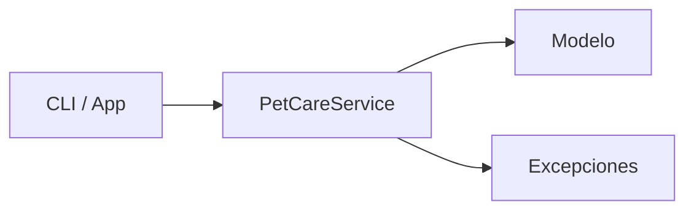
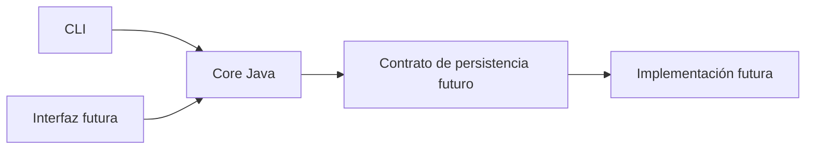

# PetCare · Arquitectura y continuidad docente

Este documento fija la dirección técnica del proyecto para evitar que cada semana convierta PetCare en un proyecto distinto.

La arquitectura se **descubre progresivamente**. No se enseña como ceremonia ni se exige crear capas vacías antes de necesitarlas.

## Estado arquitectónico al cierre de Semana 08

Una forma razonable de organizar el proyecto es:

```text
cl.duoc.petcare
├── core
│   ├── model
│   ├── service
│   └── exception
└── cli
```

No todos los proyectos de estudiantes deben tener exactamente esos packages. Lo importante es la separación de responsabilidades.

## Dependencias esperadas


```mermaid
flowchart LR
    CLI[CLI / App] --> SERVICE[PetCareService]
    SERVICE --> MODEL[Modelo]
    SERVICE --> EX[Excepciones]
```

La CLI conoce al servicio y al modelo cuando necesita mostrar información. El modelo no conoce `Scanner`, menús ni impresión por consola.

## Progresión

### Semanas 02–04

```text
App
 ↓
Mascota
 └── Tutor (opcional)
```

El foco está en objeto, estado, constructor, encapsulamiento y colaboración.

### Semana 05

La especialización aparece sólo si evita duplicación y expresa una diferencia real:

```text
Mascota
├── Perro
└── Gato
```

Evitar jerarquías creadas sólo para “demostrar herencia”.

### Semana 06

Cuando aparecen múltiples objetos, se justifica extraer coordinación desde `main`:

```text
App
 ↓
PetCareService
 ↓
List<Mascota>
```

Las excepciones representan situaciones inválidas; la capa que puede resolver o comunicar el error decide dónde capturarlas.

### Semana 07

Si `Mascota` representa un concepto incompleto que no debería instanciarse directamente, puede transformarse en abstracta.

Las interfaces modelan capacidades independientes de la jerarquía. Ejemplo conceptual:

```text
Mascota (abstracta)
├── Perro
└── Gato

Vacunable
```

Una interfaz debe responder a una capacidad real, no agregarse para cumplir una lista de conceptos.

### Semana 08

Las colecciones se eligen por intención:

```text
List<Mascota>          → colección principal / recorrido
Set<String>            → unicidad
Map<String, Mascota>   → búsqueda por clave
```

No mantener varias estructuras con los mismos datos si no existe una necesidad concreta. Si se usan simultáneamente, el estudiante debe comprender que mantenerlas sincronizadas introduce una responsabilidad adicional.

## Regla para `equals()` y `hashCode()`

No generar estos métodos automáticamente “porque sí”.

Primero definir qué significa identidad lógica para el dominio. Sólo entonces implementar `equals()` y `hashCode()` de forma coherente.

Si un atributo participa en la identidad de un objeto almacenado en `HashSet`, debe evitarse modificarlo mientras el objeto esté dentro del conjunto.

## Separación CLI / negocio

Evitar:

```java
public void registrarMascota() {
    Scanner sc = new Scanner(System.in);
    // lee datos, valida, guarda e imprime todo aquí
}
```

Preferir responsabilidades conceptualmente separadas:

```text
CLI:
- leer datos
- invocar operación
- presentar resultado

Servicio/modelo:
- validar reglas
- crear/registrar/buscar
- devolver datos o lanzar excepción
```

## Preparación para unidades futuras

La dirección sigue siendo reutilizar el core:


```mermaid
flowchart LR
    CLI[CLI] --> CORE[Core Java]
    UI[Interfaz futura] --> CORE
    CORE --> PORT[Contrato de persistencia futuro]
    PORT --> DATA[Implementación futura]
```

JavaFX, JSON y JDBC son futuras formas de interacción o persistencia. Cuando aparezcan, no deberían obligar a reescribir las reglas ya consolidadas en EA1.

## Preguntas de control antes de agregar algo

1. ¿Qué problema concreto resuelve?
2. ¿Ese concepto ya fue enseñado?
3. ¿La responsabilidad pertenece al modelo, servicio o interfaz?
4. ¿Estoy reutilizando el checkpoint anterior?
5. ¿Estoy agregando complejidad sólo para mostrar una técnica?
6. ¿El estudiante puede explicar la decisión sin recitar una definición?
