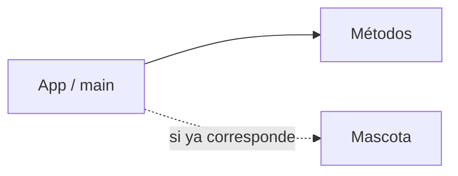

# PetCare · Modelo y checkpoint · Semana 02

## Vista conceptual



Semana 02 no exige todavía una arquitectura OO completa. El checkpoint depende del contenido efectivamente alcanzado.

## Estructura posible

```text
petcare/
└── src/
    ├── App.java
    └── Mascota.java   ← sólo si clases/objetos ya fueron trabajados
```

## Checklist técnico

- [ ] el proyecto compila y ejecuta;
- [ ] existe al menos un método con propósito;
- [ ] los parámetros y retornos pueden explicarse;
- [ ] si existe `Mascota`, representa estado coherente;
- [ ] si existe encapsulamiento, al menos una regla evita un estado inválido;
- [ ] no se utilizan conceptos no enseñados.

## Checklist de evidencia

- [ ] commit inicial de PetCare;
- [ ] al menos un incremento posterior;
- [ ] caso de ejecución visible;
- [ ] DevLog con un aprendizaje y una dificultad real.

## Preguntas de defensa

1. ¿Qué problema resuelve el método que agregaste?
2. ¿Qué diferencia hay entre parámetro y argumento en tu propio código?
3. Si ya tienes `Mascota`, ¿qué representa una instancia?
4. ¿Qué regla de estado decidiste proteger y por qué?
5. ¿Qué decidiste no agregar todavía?

## Continuidad

Semana 03 parte desde este mismo proyecto y consolida objeto, constructor, comportamiento y encapsulamiento.
