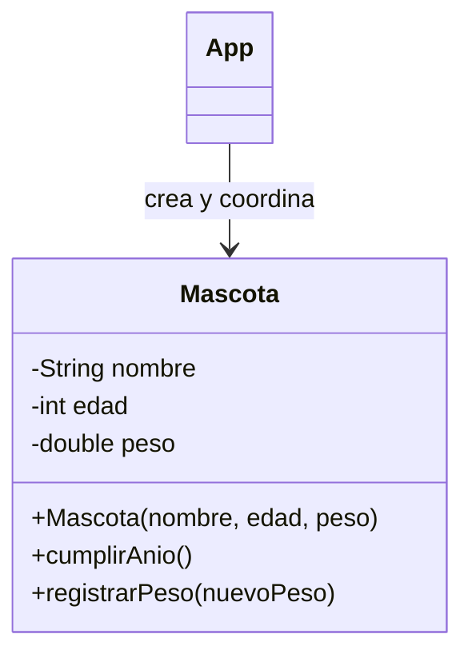

# PetCare · Modelo y checkpoint · Semana 03

## Vista conceptual



Los atributos y operaciones son ejemplos. El estudiante puede modelar otros siempre que mantenga el propósito del checkpoint.

## Estructura posible

```text
petcare/
└── src/
    ├── App.java
    └── Mascota.java
```

## Checklist técnico

- [ ] `Mascota` posee estado propio;
- [ ] existe constructor;
- [ ] existen al menos dos instancias;
- [ ] hay comportamiento de instancia;
- [ ] al menos una regla protege estado inválido;
- [ ] `App` no modifica atributos privados directamente;
- [ ] no hay herencia ni colecciones todavía.

## Checklist de evidencia

- [ ] prueba con dos objetos distintos;
- [ ] caso válido e inválido de una regla;
- [ ] commits pequeños;
- [ ] DevLog actualizado.

## Preguntas de defensa

1. ¿Qué diferencia hay entre clase y objeto en tu implementación?
2. ¿Qué hace el constructor?
3. ¿Por qué el atributo protegido es privado?
4. ¿Por qué tu método pertenece a `Mascota` y no a `main`?
5. ¿Qué pasaría si cada dato tuviera un setter sin validación?

## Continuidad

Semana 04 refina la construcción del objeto y agrega colaboración simple con otra entidad cuando corresponda.
