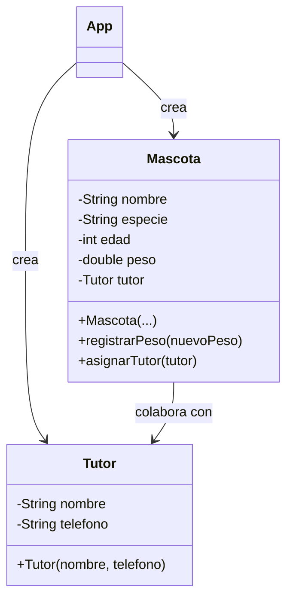

# PetCare · Modelo y checkpoint · Semana 04

## Vista conceptual



`Tutor` es una extensión posible, no un requisito si la relación aún no aporta valor al modelo del estudiante.

## Estructura posible

```text
petcare/
└── src/
    ├── App.java
    ├── Mascota.java
    └── Tutor.java
```

## Checklist técnico

- [ ] constructor deja el objeto en un estado coherente;
- [ ] atributos permanecen encapsulados;
- [ ] setters no se usan como mecanismo de inicialización indiscriminado;
- [ ] las reglas permanecen dentro del objeto correspondiente;
- [ ] existe colaboración simple si el dominio la necesita;
- [ ] cada instancia conserva estado independiente.

## Checklist de evidencia

- [ ] al menos tres objetos creados;
- [ ] una operación válida y una inválida;
- [ ] demostración de relación entre objetos si se incorporó;
- [ ] DevLog sobre distribución de responsabilidades.

## Preguntas de defensa

1. ¿Qué datos deben existir al construir una mascota?
2. ¿Por qué algunos datos se reciben en constructor y otros pueden cambiar después?
3. ¿Qué diferencia hay entre una relación entre objetos y una jerarquía de herencia?
4. ¿Qué responsabilidad tiene `Tutor` que no debería estar en `Mascota`?
5. ¿Qué getter decidiste no crear y por qué?

## Continuidad

Semana 05 toma este modelo estable y estudia si existen especializaciones reales que justifiquen herencia y polimorfismo.
