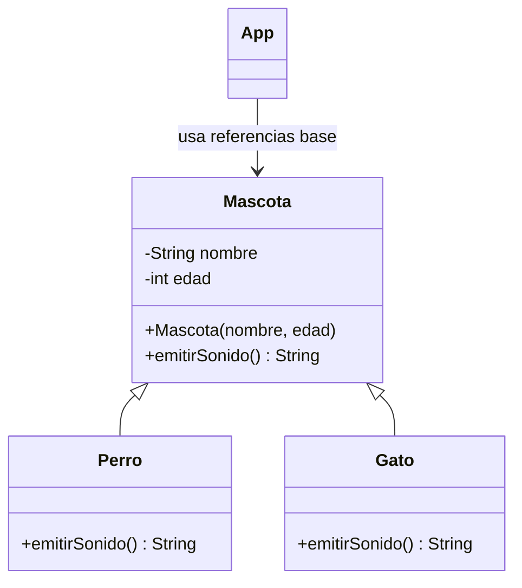

# PetCare · Modelo y checkpoint · Semana 05

## Vista conceptual



## Estructura posible

```text
petcare/
└── src/
    ├── App.java
    ├── Mascota.java
    ├── Perro.java
    └── Gato.java
```

## Checklist técnico

- [ ] existe una clase base con estado realmente común;
- [ ] existen al menos dos subtipos justificables;
- [ ] los subtipos reutilizan construcción mediante `super(...)`;
- [ ] existe al menos un método sobrescrito;
- [ ] `@Override` se utiliza correctamente;
- [ ] se demuestra polimorfismo con referencias `Mascota`;
- [ ] no se usa un gran `if/switch` para decidir comportamiento por tipo.

## Checklist de evidencia

- [ ] diagrama de jerarquía comprensible;
- [ ] ejecución de dos comportamientos especializados;
- [ ] commits de refactor + especialización;
- [ ] DevLog con una decisión de herencia.

## Preguntas de defensa

1. ¿Por qué `Perro` ES UNA `Mascota`?
2. ¿Qué inicializa `super(...)`?
3. ¿Qué diferencia existe entre sobrescribir y sobrecargar?
4. ¿Cómo sabe Java qué implementación ejecutar?
5. ¿Qué atributo o método decidiste no duplicar en los subtipos?

## Continuidad

Semana 06 mantiene la jerarquía y agrega la necesidad de administrar múltiples objetos mediante colecciones y excepciones.
