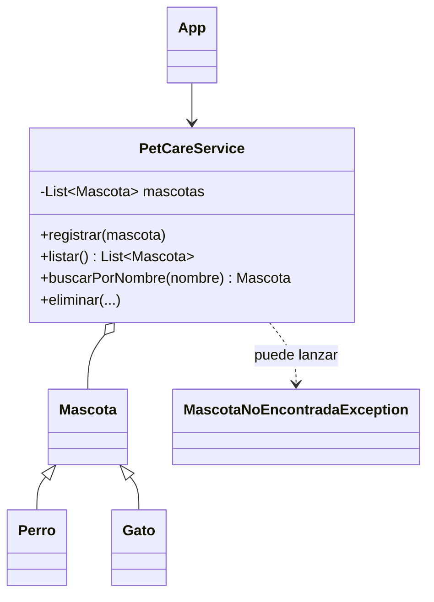

# PetCare · Modelo y checkpoint · Semana 06

## Vista conceptual



## Estructura posible

```text
petcare/
└── src/
    ├── App.java
    ├── model/
    ├── service/
    └── exception/
```

La separación en packages es sugerida si ayuda a ordenar responsabilidades; no debe transformarse en objetivo por sí misma.

## Checklist técnico

- [ ] se comprende la limitación de un array;
- [ ] la solución final utiliza `List / ArrayList` cuando necesita tamaño dinámico;
- [ ] la colección trabaja con el tipo base;
- [ ] existe alta y recorrido;
- [ ] existe búsqueda o eliminación;
- [ ] una condición inválida puede lanzar una excepción;
- [ ] la CLI captura sólo los errores que sabe comunicar;
- [ ] la lógica de colección no queda concentrada en `main`.

## Checklist de evidencia

- [ ] comparación breve array vs lista;
- [ ] caso de búsqueda exitosa;
- [ ] caso que produzca una excepción;
- [ ] commits incrementales;
- [ ] DevLog indicando quién detecta, lanza y captura.

## Preguntas de defensa

1. ¿Por qué cambiaste desde array a `List`?
2. ¿Por qué la colección es `List<Mascota>` y no una lista por subtipo?
3. ¿Qué capa sabe que una mascota no existe?
4. ¿Qué capa sabe cómo comunicar ese error al usuario?
5. ¿Qué ventaja tiene sacar las operaciones de colección desde `main`?

## Continuidad

Semana 07 revisa el diseño completo de EA1 e incorpora abstracción e interfaces sólo cuando expresen una necesidad real.
