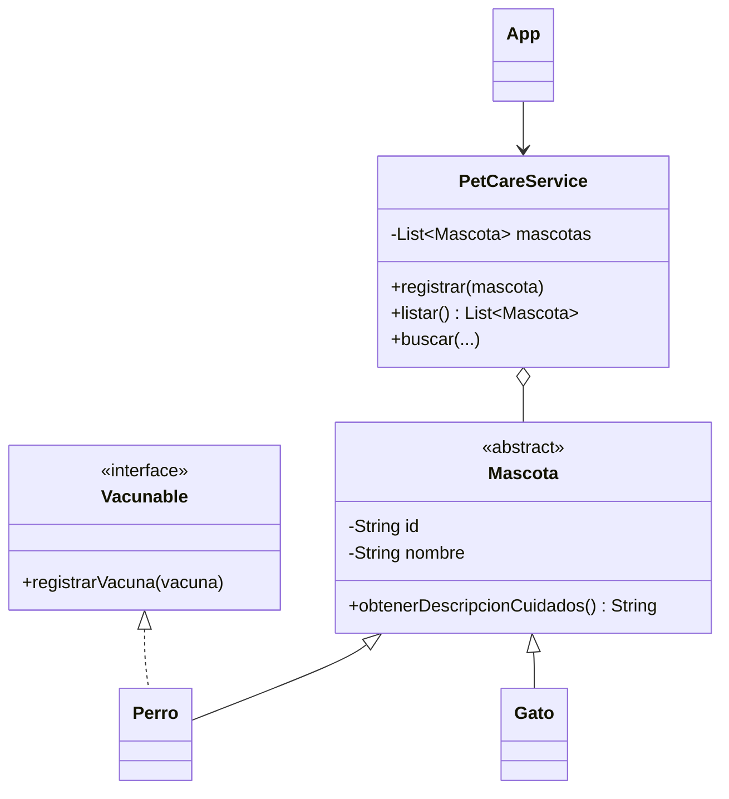

# PetCare · Modelo y checkpoint · Semana 07

## Vista conceptual



El diagrama muestra una posibilidad. `Mascota` sólo debe ser abstracta y `Vacunable` sólo debe existir si esas decisiones pueden justificarse.

## Estructura posible

```text
petcare/
└── src/
    ├── cli/
    ├── model/
    ├── service/
    └── exception/
```

## Checklist técnico

- [ ] la solución de Semana 06 sigue funcionando;
- [ ] la clase base es abstracta sólo si no tiene sentido instanciarla;
- [ ] existe al menos un método abstracto si la abstracción lo requiere;
- [ ] la interfaz representa una capacidad y no una jerarquía alternativa;
- [ ] el servicio continúa trabajando polimórficamente;
- [ ] excepciones y colección siguen integradas;
- [ ] el flujo completo de consola ejecuta de principio a fin.

## Checklist de evidencia

- [ ] caso de creación de subtipos;
- [ ] ejecución de método polimórfico;
- [ ] demostración de capacidad por interfaz si fue incorporada;
- [ ] caso de error manejado;
- [ ] DevLog con una decisión de diseño revisada.

## Preguntas de defensa

1. ¿Por qué `Mascota` debe o no debe ser abstracta?
2. ¿Qué diferencia hay entre método abstracto y método sobrescrito?
3. ¿Por qué una interfaz modela una capacidad?
4. ¿Puede una clase implementar varias interfaces? ¿Qué implicaría en tu diseño?
5. ¿Qué parte del sistema podría reutilizarse con otra interfaz de usuario?

## Continuidad

Semana 08 no reemplaza estas estructuras: agrega criterio para decidir cuándo `Set` o `Map` expresan mejor una necesidad.
