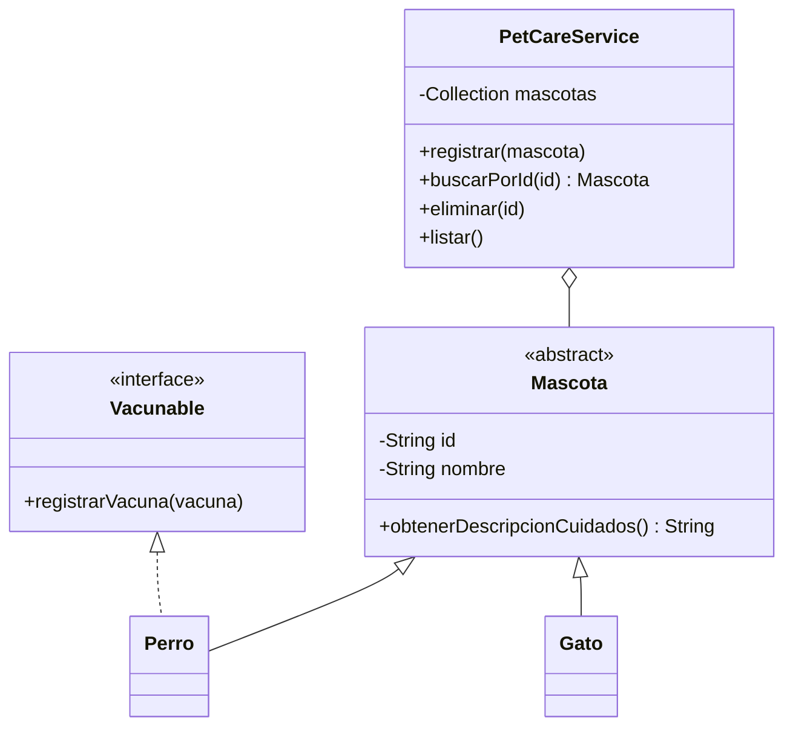

# PetCare · Modelo y checkpoint · Semana 08

## Vista conceptual



El tipo concreto de colección dentro del servicio depende de la necesidad elegida.

## Decisión de colección

| Necesidad | Estructura habitual | Pregunta que responde |
|---|---|---|
| recorrer y mantener múltiples elementos | `List` | ¿qué mascotas administra el sistema? |
| impedir duplicados | `Set` | ¿este valor ya está registrado? |
| buscar mediante identificador | `Map` | ¿qué mascota corresponde a esta clave? |

No existe obligación de usar las tres.

## Estructura posible

```text
petcare/
└── src/
    ├── cli/
    ├── model/
    ├── service/
    └── exception/
```

La arquitectura no necesita cambiar sólo porque cambia una colección interna.

## Checklist técnico

### Modelo

- [ ] encapsulamiento preservado;
- [ ] herencia y polimorfismo siguen justificados;
- [ ] abstracción e interfaces no fueron agregadas artificialmente;
- [ ] la identidad lógica está definida si se implementa `equals/hashCode`.

### Colecciones

- [ ] `List` se usa sólo si resuelve secuencia/recorrido;
- [ ] `Set` se usa sólo si existe unicidad;
- [ ] `Map` se usa sólo si existe clave → valor;
- [ ] no existen estructuras redundantes sin propósito;
- [ ] si hay varias estructuras, las operaciones mantienen consistencia.

### Servicio y CLI

- [ ] el servicio coordina reglas sobre múltiples objetos;
- [ ] la CLI no conoce detalles internos de almacenamiento;
- [ ] las excepciones siguen comunicándose en la capa apropiada.

## Checklist de evidencia

- [ ] requerimiento que motiva la colección nueva;
- [ ] caso válido;
- [ ] caso duplicado o clave inexistente;
- [ ] comparación razonada con una alternativa;
- [ ] DevLog con decisión y descarte;
- [ ] aplicación completa compilable y ejecutable.

## Preguntas de defensa

1. ¿Por qué elegiste `List`, `Set` o `Map`?
2. ¿Qué problema aparecería si usaras otra estructura?
3. Si usas varias colecciones, ¿cómo mantienes consistencia?
4. ¿Qué significa igualdad lógica en tu modelo?
5. ¿Por qué el atributo usado en `hashCode()` debería ser estable?
6. ¿Qué parte del sistema cambiaría si mañana cambia la colección interna?
7. ¿Qué parte debería permanecer igual?

## Cierre EA1

El estudiante debe poder recorrer la historia completa de PetCare:

```text
métodos
→ objetos
→ encapsulamiento
→ construcción
→ colaboración
→ herencia
→ polimorfismo
→ colecciones
→ excepciones
→ abstracción
→ interfaces
→ criterio List / Set / Map
```

El valor del proyecto no está en acumular técnicas, sino en poder explicar **por qué cada una apareció y qué problema resolvió**.
