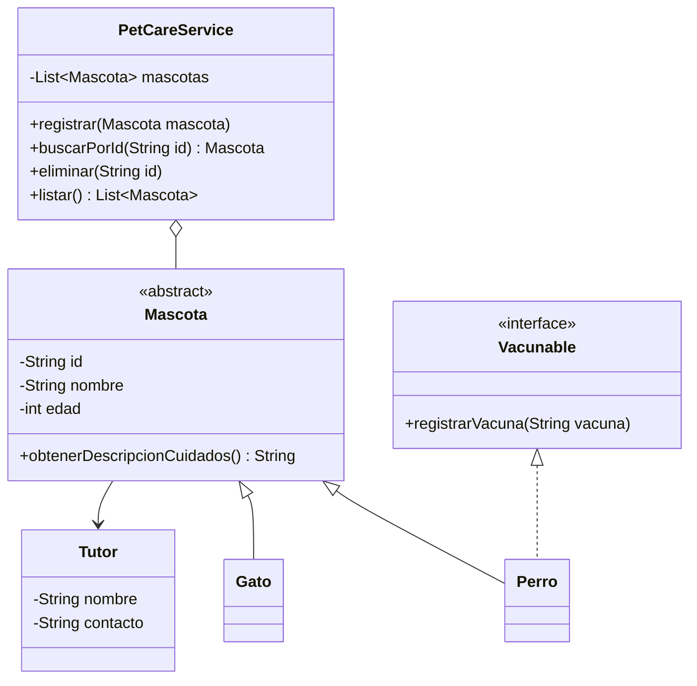

# PetCare · Modelo y checkpoint de cierre · Semana 08

Este documento no define una solución única. Es una referencia para revisar si el proyecto evolucionó de forma coherente durante EA1.

## Vista conceptual



La interfaz `Vacunable`, los subtipos y las operaciones son ejemplos. Deben ajustarse a las decisiones reales del estudiante.

## Colecciones posibles

### Colección principal

```java
private final List<Mascota> mascotas = new ArrayList<>();
```

Útil cuando el caso requiere recorrer, filtrar y mantener una secuencia de elementos.

### Unicidad

```java
private final Set<String> idsRegistrados = new HashSet<>();
```

Útil cuando un identificador no puede repetirse.

### Índice por clave

```java
private final Map<String, Mascota> mascotasPorId = new HashMap<>();
```

Útil cuando la búsqueda directa por identificador es una operación central.

## Atención: duplicar estructuras tiene costo

Este diseño:

```text
List<Mascota>
Set<String>
Map<String, Mascota>
```

puede ser correcto, pero obliga a mantener tres estructuras consistentes.

Para un proyecto formativo pequeño, muchas veces basta con una o dos.

La elección correcta es la mínima que exprese bien el requerimiento.

## Checklist técnico

### Modelo

- [ ] atributos privados;
- [ ] constructor coherente;
- [ ] estado protegido;
- [ ] herencia justificada;
- [ ] sobrescritura real;
- [ ] abstracción justificada;
- [ ] interfaces sólo para capacidades reales.

### Colecciones

- [ ] `List` se usa por una necesidad de colección dinámica/recorrido;
- [ ] `Set` se usa sólo si existe unicidad;
- [ ] `Map` se usa sólo si existe clave → valor;
- [ ] no existen estructuras redundantes sin propósito;
- [ ] `equals/hashCode` reflejan una identidad explícita cuando son necesarios.

### Servicio

- [ ] coordina operaciones sobre múltiples objetos;
- [ ] no depende de `Scanner`;
- [ ] no imprime como mecanismo principal de retorno;
- [ ] lanza o propaga errores significativos cuando corresponde.

### CLI

- [ ] lee opciones y datos;
- [ ] invoca operaciones;
- [ ] muestra resultados;
- [ ] captura errores que puede comunicar al usuario;
- [ ] no contiene todas las reglas del dominio.

## Checklist de defensa

El estudiante puede explicar:

1. por qué diseñó la jerarquía actual;
2. qué comportamiento es polimórfico;
3. por qué una clase es abstracta o por qué decidió no hacerla abstracta;
4. qué aporta una interfaz concreta;
5. por qué eligió cada colección;
6. dónde ocurre una validación;
7. dónde se lanza y captura una excepción;
8. qué parte del código podría reutilizarse si mañana cambia la interfaz de usuario.

Si puede responder esas preguntas mostrando su código, el checkpoint cumple el propósito formativo de EA1.
